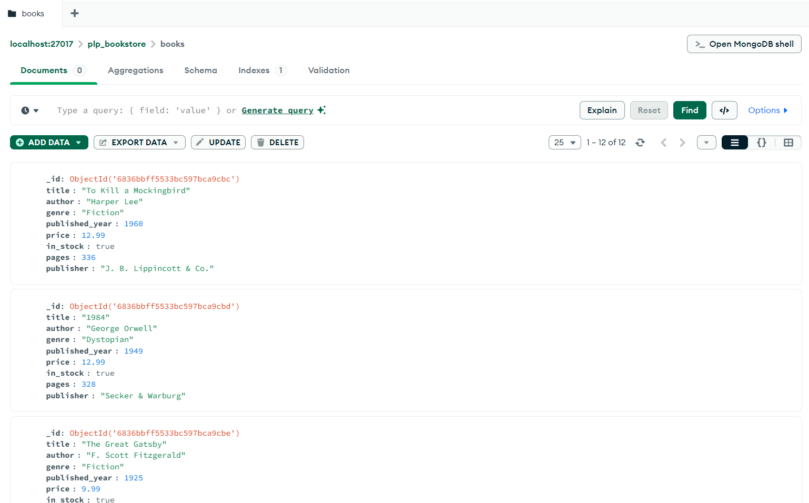

[](https://classroom.github.com/online_ide?assignment_repo_id=19646063&assignment_repo_type=AssignmentRepo)
# MongoDB Fundamentals Assignment

This repository contains my implementation of the MongoDB fundamentals assignment, demonstrating various MongoDB operations including setup, CRUD operations, advanced queries, aggregation pipelines, and indexing.

## Implementation Details

### Task 1: MongoDB Setup
- Created a new database called `plp_bookstore`
- Created a collection called `books`
- Implemented data insertion with 13 book documents containing all required fields:
  - title (string)
  - author (string)
  - genre (string)
  - published_year (number)
  - price (number)
  - in_stock (boolean)
  - pages (number)
  - publisher (string)

### Task 2: Basic CRUD Operations
Implemented the following queries:
- **Create**: Inserted 13 books using `insertMany()`
- **Read**: 
  - Find books in "Adventure" genre
  - Find books published after 1950
  - Find books by J.D. Salinger
- **Update**: Modified the price of "1984" to $12.99
- **Delete**: Removed "The Book Thief" from the collection

### Task 3: Advanced Queries
Implemented complex queries demonstrating:
- Combined conditions: Finding books that are both in stock and published after 2010
- Projection: Returning only title, author, and price fields
- Sorting: Displaying books by price in both ascending and descending order
- Pagination: Implemented using `limit()` and `skip()` for 5 books per page

### Task 4: Aggregation Pipeline
Created three aggregation pipelines:
1. **Average Price by Genre**: Calculates the average book price for each genre
2. **Most Prolific Author**: Finds the author with the most books in the collection
3. **Decade Analysis**: Groups books by publication decade and counts them

### Task 5: Indexing
Implemented performance optimization through:
- Single field index on the `title` field
- Compound index on `author` (ascending) and `published_year` (descending)
- Used `explain()` to demonstrate query performance improvements

## Screenshots

### Database Setup and Initial Data


### Query Results


### Aggregation Results


### Index Performance


## How to Run the Queries

1. Start MongoDB shell:
```bash
mongosh
```

2. Switch to the bookstore database:
```bash
use plp_bookstore
```

3. Run the queries from `queries.js` one by one to see the results.

## Query File Structure

The `queries.js` file is organized into sections:
1. Database and collection setup
2. Data insertion
3. Basic CRUD operations
4. Advanced queries
5. Aggregation pipelines
6. Index creation and analysis

Each query is documented with comments explaining its purpose and expected results.

## Tools Used

- MongoDB Shell (mongosh)
- MongoDB Compass (for visualization)
- MongoDB Community Edition

## Note

The queries are designed to be run sequentially as some operations depend on the results of previous ones. For example, indexes should be created before running the explain() command.

## Resources

- [MongoDB Documentation](https://docs.mongodb.com/)
- [MongoDB University](https://university.mongodb.com/)
- [MongoDB Node.js Driver](https://mongodb.github.io/node-mongodb-native/) 